# Query Samples

__Queries__ allow the filtering of __sample variants__, to investigate relations to other samples, to load __virtual gene__ panels (gene names or genomic relevant regions) and predefined __standardised filters__.

## Sample selection
A sample identifier is searched and selected across all accessible VCF files. The list can be filtered by the sample and file name. To select a sample, double-click on its name.

## Virtual Gene Panel
Disease specific panels can be pre-defined in DART to simplify analyses of known phenotypes. Panels can be defined as HGNC gene 
names or as genomic relevant regions in BED file format. The use of panels can be 
enforced to prevent secondary findings. 

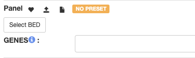

## Filtering
The query system allows to create rules (filtering conditions) on each of the VCF fields. The rules can be logically group together. 
Disease specific filtering strategies can be prepared to allow for 
different modes of inheritance (e.g. dominant, recessive) and 
expected frequency in the population.

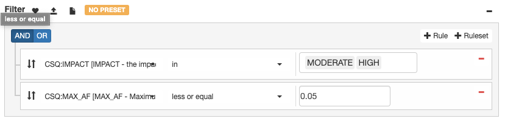

## Query status
Once the query is submitted its status is visualized. For each filtering strategy there are three queries running:

- count: the query counts of all variants meeting the criteria
- variants: the query returns the first 2000 variants meeting the criteria
- coverage: the query returns all the problematic regions within the selected virtual panel  

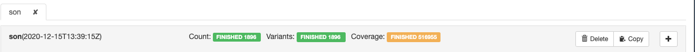
 
## Query result
By clicking on the banner close to the variants or coverage query statuses, the results can be explored.
 
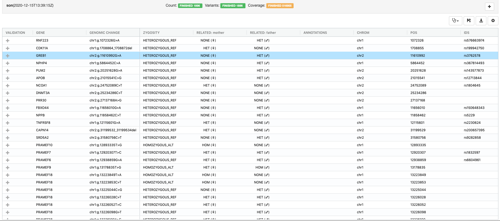

### Variant details
By double clicking on a variant relevant information is visualised in a summary panel
 
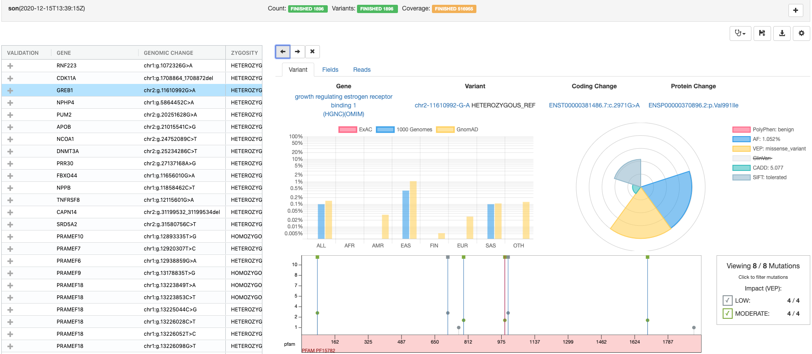

### Sequencing reads visualization
By clicking on the Reads panel a genome browser is shown in order to investigate sequencing and alignment quality
 
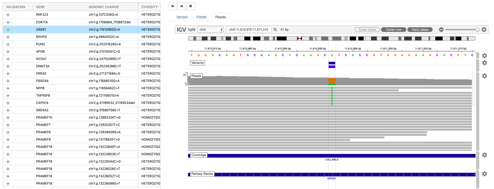

## Disease focus
Disease context specific analysis of a patient enables the clinical assessment of variants for the selected disease(s). Previous variant annotations are displayed and highlighted depending on the disease focus.
For a given patient it is possible to specify a phenotype by clicking on the clincal curation icon
 
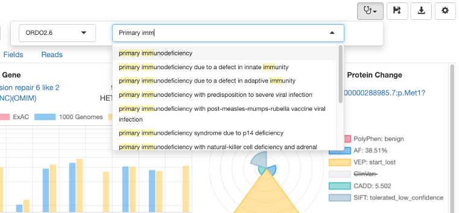

## Variant curation
DART supports the ACMG-AMP annotation of variants in the disease context. Variant annotations are stored in DART as a knowledge base and provided as guidance across samples and diseases.

The variants can be both annotated for quality by clicking on the VALIDATION column, in which case the annotation is specific for the variant, the sample and the vcf file or by clincal significance by clicking on the ANNOTATIONS column,
in which case the annotation is specific for the variant and the selected phenotype. 

### Validation curation
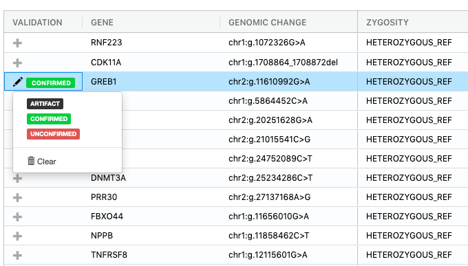

### Pathogenicity curation
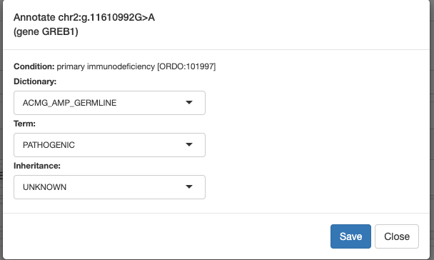

### Visualization of annotated variants

## Report generation
Once the curation activity is complete, a report can be generated by clicking on the disk icon.   
 
 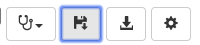

Please, note that both the panel preset (even if empty) and the query preset must be saved and given a name by clicking on the respective "hearth" icon:

 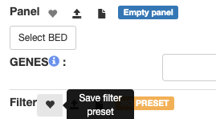 
 
 Saving a report can take some time since all the variants and coverage results are saved permantently in the SQL database. **It is highly recommended to narrow the filtering
  to a specific gene panel to save storage and time.**